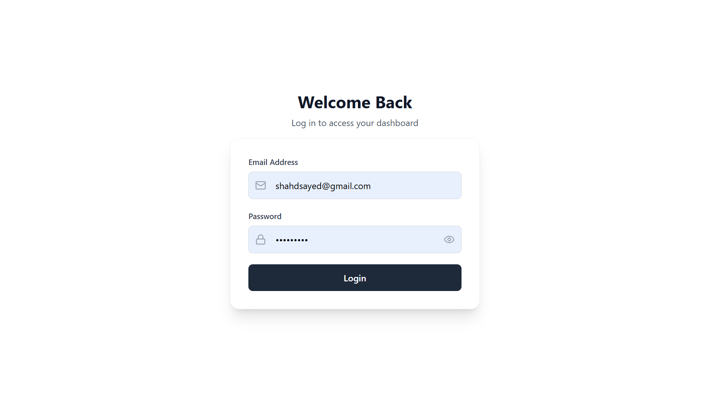
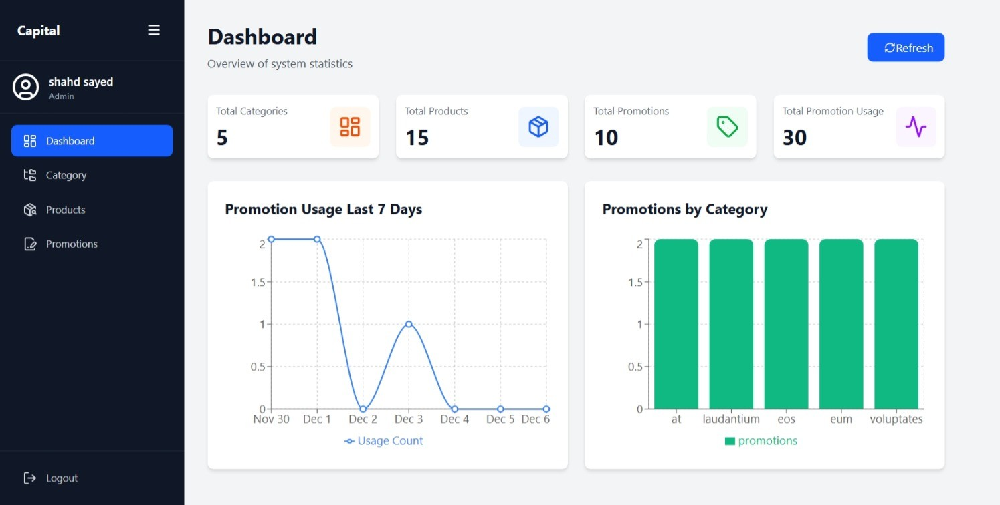
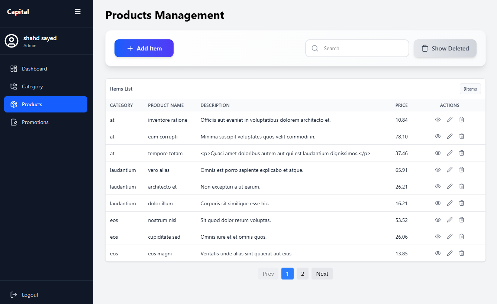
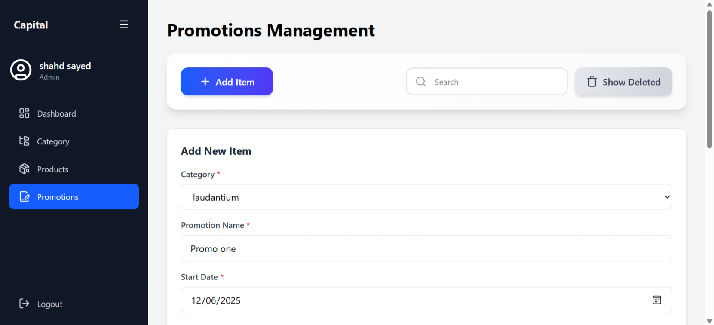
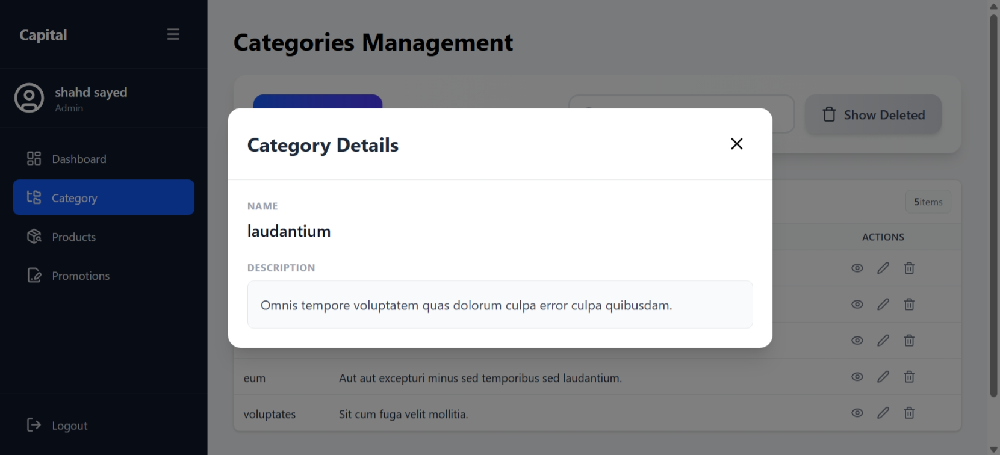
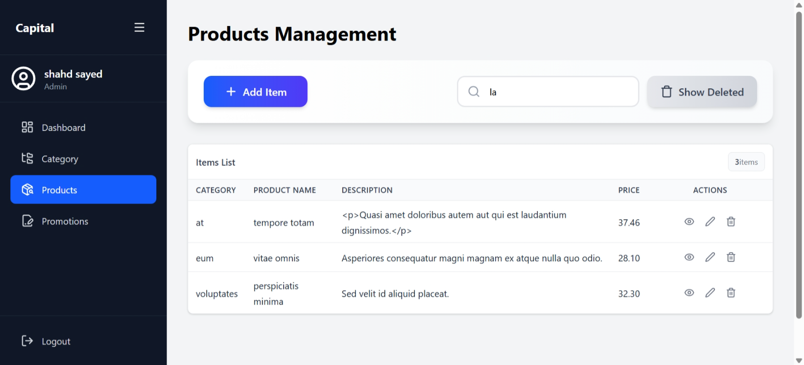

# CapitalArgo — Admin Frontend

Project frontend for managing categories, products and promotions. This React + Vite app provides an admin dashboard with CRUD interfaces, charts, and utilities to manage promotions and apply them to products. It expects a separate REST API backend (authenticated via Bearer token) available at the `VITE_API_URL` environment variable.

**Status:** Frontend-only in this repository. Backend API is required to use the app.

**Table of contents**
- Project overview
- Features
- Technologies used
- Backend installation (overview)
- Frontend installation (local)
- Environment variables
- Database import instructions
- API summary & example requests
- Screenshots (notes)

---

## Project overview

CapitalArgo is an admin dashboard application that lets administrators manage categories, products and promotions. The app includes:
- Authentication (login) with token stored in a cookie
- CRUD for categories, products and promotions
- Assigning products to promotions and applying promotions to products
- Dashboard statistics and charts (promotion usage, promotions by category)
- Utilities: search, pagination, soft-delete (trash), restore, permanent delete

This repository contains the frontend implementation (React + Vite). The frontend communicates with a REST API under the path `/api` on the configured backend host.

## Features

- Login / Auth (stores JWT in cookie)
- Dashboard with charts and summary cards
- Categories management (add/edit/delete/restore)
- Products management (add/edit/delete/restore), including image upload support
- Promotions management (create promotion, attach/detach products)
- Apply promotion: list available products for a promotion and apply promotion to product
- Pagination, searching, and toast notifications

## Technologies used

- React 19
- Vite
- Tailwind CSS
- Redux Toolkit
- React Router DOM
- Axios
- Recharts (charts)
- Quill (rich text editor used in forms)
- SweetAlert2 (alerts)
- lucide-react (icons)

## Backend installation (overview)

This frontend requires a compatible REST API backend that exposes endpoints under `/api` and supports JWT (Bearer) authentication. The frontend expects endpoints such as `/api/login`, `/api/admin/products`, `/api/admin/categories`, `/api/admin/promotion`, and various `/admin/...` routes used in pages.

If you already have the backend repository, follow its README. If not, a typical backend setup (example with Node/Laravel) would be:

1. Clone backend repo and cd into it
2. Install dependencies (e.g., `composer install` for Laravel or `npm install` for Node)
3. Copy `.env.example` to `.env` and configure DB and APP_URL
4. Run database migrations: `php artisan migrate --seed` (Laravel) or the equivalent
5. Start the backend server: `php artisan serve` or `npm run dev`


## Frontend installation (local)

Prerequisites: Node.js (v16+ recommended) and npm.

1. Open the project root (this repo):

```powershell
cd "c:\React Build Projects\CapitalArgo"
```

2. Install dependencies:

```powershell
npm install
```

3. Create an environment file at the project root named `.env` (or use `.env.local`) and set required vars (see next section).

4. Run the dev server:

```powershell
npm run dev
```

5. Build for production:

```powershell
npm run build
```

6. Preview production build locally:

```powershell
npm run preview
```

## Environment variables

The frontend reads these variables at build/runtime via Vite's `import.meta.env`:

- `VITE_API_URL` - The base URL of the backend API (e.g. `http://localhost:8000` or `https://api.example.com`). The frontend will append `/api` automatically (see `src/api/axiosClient.jsx`).

Example `.env`:

```text
VITE_API_URL=http://localhost:8000
```

Notes:
- The token is stored in a cookie named `token` by the auth slice. The axios client reads it using `getCookie('token')` and sets `Authorization: Bearer <token>` header on requests.
- If you host the frontend and backend on different domains, ensure CORS is configured on the backend and cookies or Authorization header are handled accordingly.

## Database import instructions

Database instructions depend on the backend implementation. Below are generic MySQL steps to import a SQL dump named `database_dump.sql`:

```powershell
# create database (MySQL)
mysql -u root -p -e "CREATE DATABASE capitalargo_db;"
# import dump
mysql -u root -p capitalargo_db < path\to\database_dump.sql
```

If the backend uses migrations (e.g., Laravel), prefer running migrations/seeds instead of importing a dump:

```powershell
# Laravel example
php artisan migrate --seed
```

If you do not have a database dump, run backend-provided migrations/seeds per backend README.

## API documentation summary

Below is a summary of the main API endpoints the frontend calls (discovered in source code). This is not an exhaustive API spec; consult the backend's API docs for full details.

- POST `/api/login`
  - Description: Authenticate user and return token + user data
  - Example payload: `{ "email": "admin@example.com", "password": "secret" }`

- GET `/api/admin/dashboard/stats`
  - Description: Dashboard summary statistics

- GET `/api/admin/dashboard/promotions-by-category`
  - Description: Promotions aggregated by category

- GET `/api/admin/products` and POST/PUT/DELETE `/api/admin/products`
  - Description: CRUD for products

- GET `/api/admin/categories` and POST/PUT/DELETE `/api/admin/categories`
  - Description: CRUD for categories

- GET `/api/admin/promotion` and POST/PUT/DELETE `/api/admin/promotion`
  - Description: CRUD for promotions; attach/detach products endpoints used by frontend

- GET `/api/admin/promotion/:id/products`
  - Description: Get products available/attached to a promotion

- POST `/api/admin/promotions/apply`
  - Description: Apply a promotion to a product
  - Example payload: `{ "promotion_id": 123, "product_id": 456 }`

- GET `/api/admin/promotions/:id/logs` or similar
  - Description: Promotion application logs

Authentication:
- All `/admin/*` endpoints expect a `Authorization: Bearer <token>` header. The frontend places the token from cookie into the header via `src/api/axiosClient.jsx`.

Example cURL (login):

```bash
curl -X POST "${VITE_API_URL:-http://localhost:8000}/api/login" \
  -H "Content-Type: application/json" \
  -d '{"email":"admin@example.com","password":"secret"}'
```

Example cURL (get products):

```bash
curl -H "Authorization: Bearer <TOKEN>" "${VITE_API_URL:-http://localhost:8000}/api/admin/products"
```

Postman collection:
- You can create a collection with the endpoints above. Set a collection-level environment variable `VITE_API_URL` and an `auth_token` variable to use in `Authorization: Bearer {{auth_token}}` header.

## Screenshots

- Example admin views (screenshots taken from the running app and stored in the `docs` folder):














- To add more screenshots, place images in `docs/` (or `docs/screenshots/`) and add Markdown image links like ``.

---

## Where to look in the code

- API client: `src/api/axiosClient.jsx`
- Pages: `src/Pages/*` (Login, Dashboard, Category, Product, Promotion, ApplyPromotion)
- Reusable components: `src/Components/*`
- State: `src/state/authSlice.jsx`, `src/state/Store.jsx`
- Hooks: `src/hooks/useCrud.jsx`, `src/utils/useUtils.jsx`

---
